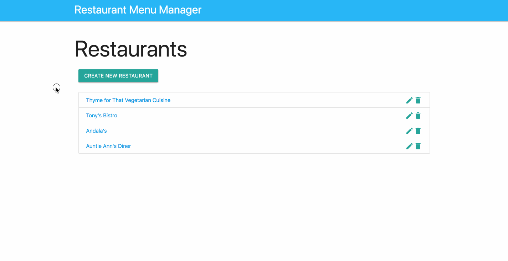

# Restaurant Menu Manager

This is an example flask application to demonstrate how to use flask.

With this application you can:

- Add/edit/remove restaurants
- Add/edit/remove menu-items for each restaurant

Warning: This is just an example. There is no input/output sanitize or validation.

<!-- MarkdownTOC levels="1" autolink=true autoanchor=false bracket="round" -->

- [Installation](#installation)
- [Example](#example)

<!-- /MarkdownTOC -->

## Installation

Install the dependencies:

```sh
pip install -r requirements.txt
```

Setup the SQLite-DB with example content:

```sh
python database_setup_with_example_data.py
```

Then start your flask-application server:

```sh
python server.py
```

## Example


